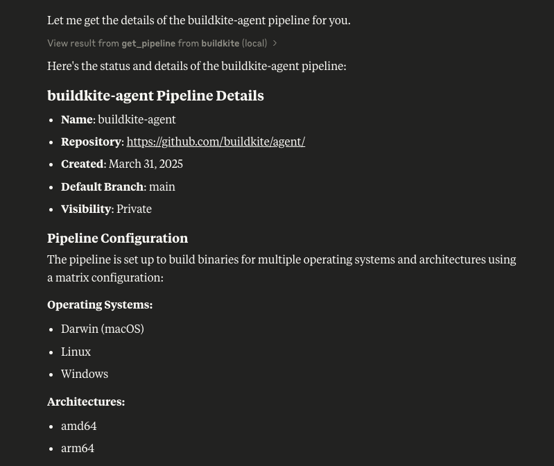

# buildkite-mcp-server

This is an mcp server for buildkite.

# Tools

* `get_pipeline` - Get details of a specific pipeline in Buildkite
* `list_pipelines` - List all pipelines in a buildkite organization

Example of the `get_pipeline` tool in action.



# prerequisites

* [goreleaser](http://goreleaser.com)
* [go 1.24](https://go.dev)

# building

Build the binary.

```
make build
```

Copy it to your path.

# configuration

```json
{
    "mcpServers": {
        "buildkite": {
            "command": "buildkite-mcp-server",
            "args": [
                "stdio"
            ],
            "env": {
                "BUILDKITE_API_TOKEN": "bkua_xxxxxxxx"
            }
        }
    }
}
```


## Disclaimer

This project is in the early stages of development and is not yet ready for use.

## License

This project is released under MIT license.